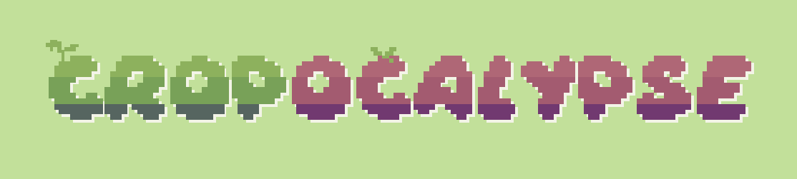
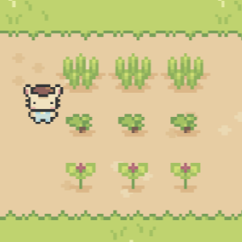
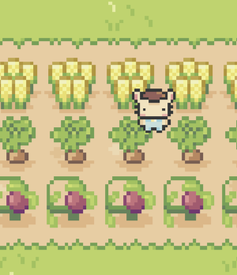
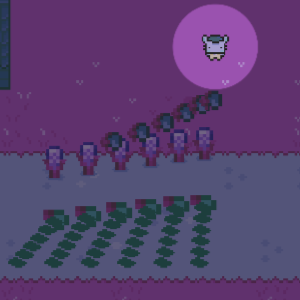
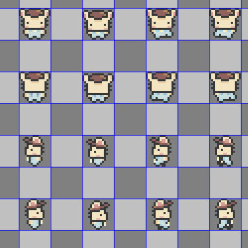

Cropocalypse is a 2D top-down survival farming simulator game with pixel graphics developed by my team and I in ICS 369 utilizing Unity game engine during the spring 2023 semester. The game draws inspiration from well-known indie titles similar to "Stardew Valley" and "Enter the Gungeon" aiming to combine two starkly different motifs: peaceful farming simulator and hectic bullet hell in a quirky and cute way.

### Synopsis

  
  
  

After graduating college with a degree in civil engineering, you find yourself with no job opportunities. You decide to restore your family’s abandoned farm and make a living as a farmer. Grow crops and sell them at the town’s market! But as the night falls, you soon realize why the farm was abandoned in the first place.

Follow Fluffy the bunny on a farming journey like no other, literally.

### The fruits of my labor

For this project I took on the role of the game artist and held the responsibility of creating all the asset art, implementing the animations, designing the user-interface and programming a good portion of the scripts. Throughout this project I was working outside of my comfort zone as I am not usually the artistic type. I learned to utilize Aseprite, which is a premier pixel art software that I had no experience using prior, and picked up basic color and animation theory in order to ensure that our game looked presentable aesthetics-wise. I had to be the versatile in an especially slim amount of time during this project and it was a challenging yet lucrative experience as I learned so much.

Aside from learning Unity game engine and to program in C#, I learned how to collaborate with a team of like-minded individuals of varying skills and backgrounds. It was especially enjoyable to have the opportunity to have consistent input and feedback from others as we all were learning how to navigate software engineering through the medium of game development and design. I found it amazing how through game development one can bridge the gap between art and programming as I saw my art come to life by the final product.

Cropocalypse will always have a special place in my heart as one of the greater projects to come out of my courses that taught me how adapt in a collaborative setting and realize my potential as an aspiring game developer.
