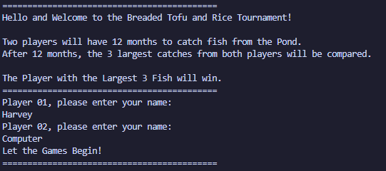
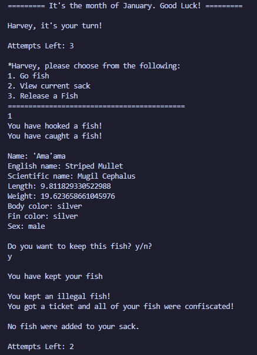
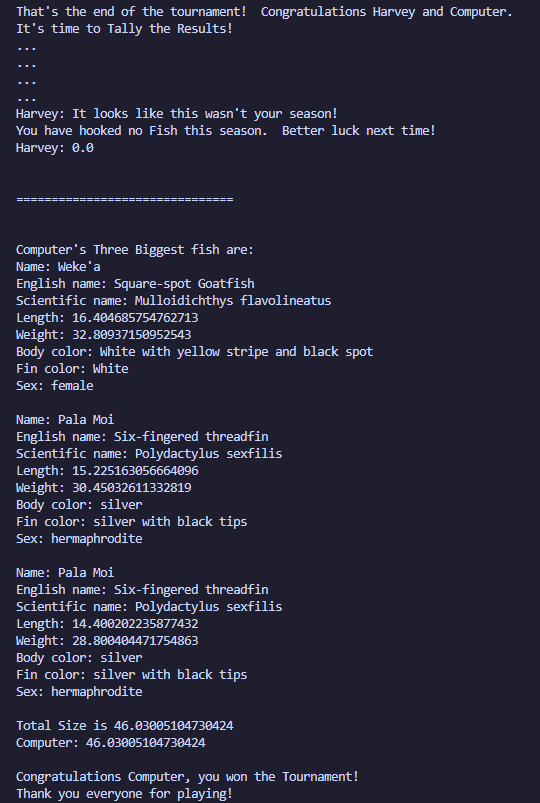

My team and I created a text-based Hawaiian fishing tournament simulator game during the spring semester of ICS 211. This collaborative effort compiled a semester's worth of learning object-oriented programming and intermediate data structures all using the Java programming language.

### Synopsis

Loko i'a and Lawa i'a are the Hawaiian words for fish pond and fishing respectively. In this text-based Hawaiian fishing tournament simulator, the goal is to catch the largest cumulative fish compared to your competitor. The game utilizes data from real Hawaiian fish families that exist and are caught locally.




## Contributions


Throughout this project, I was responsible mainly for implementing the code for the various fish families and the hierarchies of inheritance. I have provided a code snippet of the 'Ama'ama fish family class I wrote:

```
/**
* 'Ama'ama fish object class.
* Third type version of 'Ama'ama fish family.
* @author Harvey Lafradez
* @since 02/23/2022
*/

//class declaration header
public class Ama_ama extends Kahaha {
   
   // Constants for this fish.
   // protected will be inherited by subclasses unless replaced

   /** constant maximum length for this Ia. 
   * Private because not inherited.
   */
   private static final double AMA_AMA_MAX_LENGTH = 12.0;
   
   /** constant minimum length for this Ia. 
   * Private because not inherited.
   */
   private static final double AMA_AMA_MIN_LENGTH = 8.0;
   
   //========= constructors =========
   
   /**
   * Constructor for making 'Ama'ama with random length. 
   * uses I_a superclass constructor
   * uses dietItems array from super class
   * randomly sets length within allowed values after calling constructor.
   * randomly sets sex to either male or female after calling constructor.
   * @throws FishSizeException if length exceeds maxLength or is less than minLength
   * Must send minLength through as a temp length or throws exception
   */
   public Ama_ama() {
      super("'Ama'ama", AMA_AMA_MAX_LENGTH, AMA_AMA_MIN_LENGTH, 
         AMA_AMA_MIN_LENGTH, (AMA_AMA_MIN_LENGTH * 2), 
            DIET_ITEMS,  "silver", "silver", "male or female"); 
      //method is in superclass but will use max, min length set above
      this.initLength();
      
      //set random sex
      this.initSex();
   }
...
```

Looking back on my code, I realized how meticulous I was when it came to coding style and best practices as I wanted to ensure that my code was easily understood by my team members as well as other developers. I had included a copious amount of comments throughout my portions of the program and it reflects how serious I was about learning Java and applying it to a small-scale software engineering project. This project had essentially taught me to not only apply the skills I've learned throughout the semester but to also demonstrate good organizational skills as the workload was a bit overwhelming at times. During that semester we were also introduced to GitHub and version control practices and I made sure to utilize those in order to lead my team towards success.
