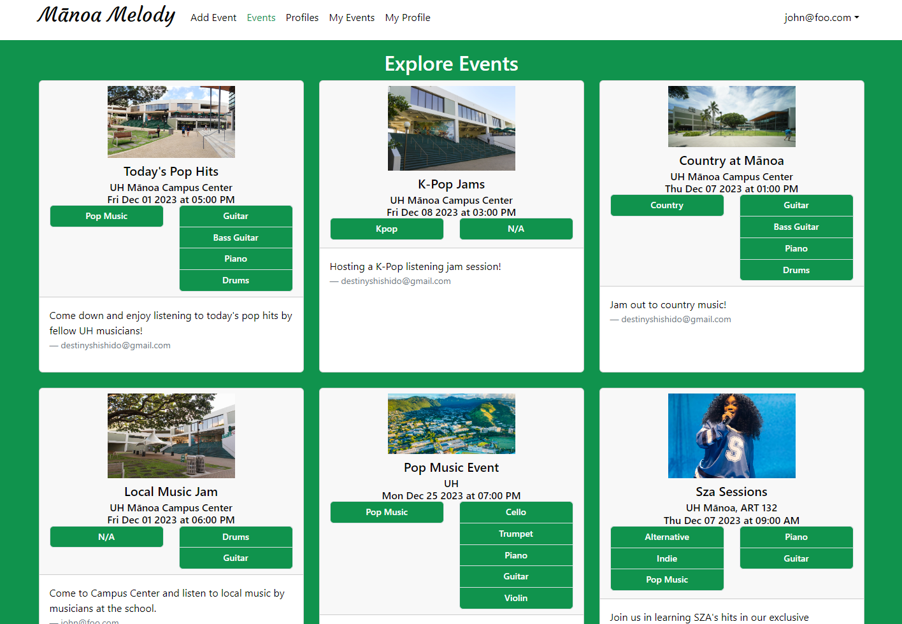
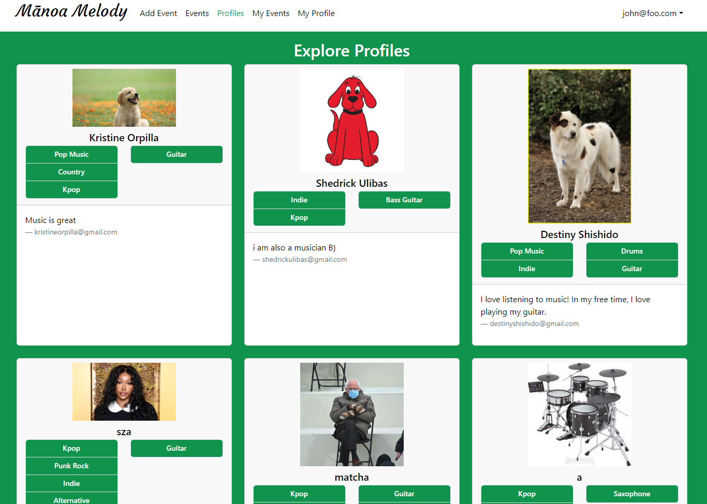

Mānoa Melody is a website my team and I developed during ICS 314 as our software engineering final project. This web application hopes to resolve an ongoing issue that many musically-inclined students at the University of Hawaiʻi at Mānoa face--the means to connect and network with other like-minded individuals who share the same musical interests and talents. Hence, Mānoa Melody is a web application that does just that. 

[Learn more about Mānoa Melody here!](https://github.com/manoa-melody)
[Our project source code can also be found here.](https://github.com/manoa-melody)

### Finding the melody

  
  

### Working in harmony
