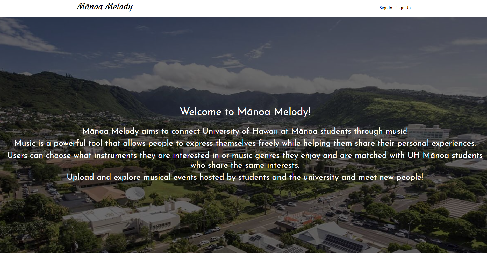

Mānoa Melody is a website my team and I developed during ICS 314 as our software engineering final project. This web application hopes to resolve an ongoing issue that many musically-inclined students at the University of Hawaiʻi at Mānoa face--the means to connect and network with other like-minded individuals who share the same musical interests and talents. Hence, Mānoa Melody is a web application that does just that. 

[Learn more about Mānoa Melody here!](https://github.com/manoa-melody)  
[Our project source code can also be found here.](https://github.com/manoa-melody)

### Finding the melody

  
  

The web application functionality my team and I successfully implemented included extensive exploration pages for both events and user profiles. These two pages serve as the main networking outlets for new users to connect with others and organize music-related events amongst one another. Profile pages are also fully customizable upon sign-up, and users are also fully able to host and sign up for events.

### Working in harmony

Just like being a part of a symphony ensemble, software development requires a team and its members to work in harmony. My contributions, apart from the landing page of the web application, was solely on unit, integration, and acceptance testing of our software project. I utilized TestCafe, an end-to-end testing framework for web applications, to simulate common user scenarios for when our website is in use. I created the majority of these tests for our project to diagnose our software application before deployment of new updates, and allowed the website to be fully functional without errors.

### Coda, the ending of a composition

Overall, I learned an immense amount concerning software development and the inner-workings of software engineering outside the scope of programming. While yes, programming is a crucial aspect of software development, it is more so true that without collaboration and being able to work harmoniously within a team, one can not make the most out of software development. The Mānoa Melody web application that my team and I worked on is a product of our combined strengths and weaknesses as a group, and I personally would say that I am especially proud of what our collaboration yielded.