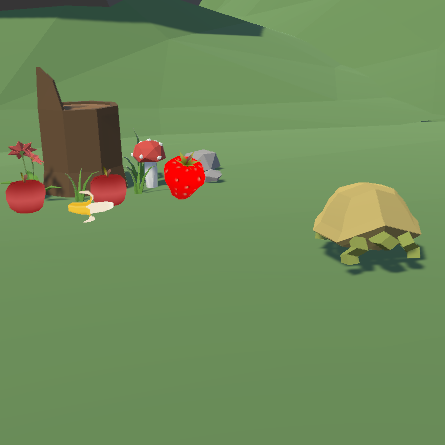
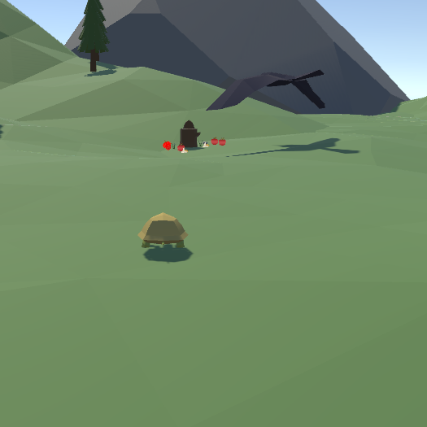

Turtle's Fruitopia is a quirky indie fruit collection game I developed two months into learning Unity game engine during the spring semester of ICS 369. During the time I was taking the course, I was obsessed with videos of turtles eating fruit and thus, came forth my first Unity game.

### The beginnings of my game developer journey




At the time I was developing "Turtle's Fruitopia", I had freshly learned how to program in C# and utilize the free community-created assets in Unity. Although all of the art and models included in my game were not originally mine, I programmed the entirety of the game object implementations and functionality. I have provided a snippet of the code that I wrote which controlled the collection system on game object collisions:

```
public class Fruits : MonoBehaviour
{
    private void OnTriggerEnter(Collider other)
    {
        PlayerInventory playerInventory = other.GetComponent<PlayerInventory>();

        if (playerInventory != null) // colliding with the player
        {
            
            // check which fruit is collided with
            if (this.gameObject.tag.Equals("Banana"))
            {
                playerInventory.FruitCollected(1); // pass in integer 1 for bananas
                gameObject.SetActive(false);
            }
            else if (this.gameObject.tag.Equals("Apple"))
            {
                playerInventory.FruitCollected(2); // pass in integer 2 for apples
                gameObject.SetActive(false);
            }
            else if (this.gameObject.tag.Equals("Strawberry"))
            {
                playerInventory.FruitCollected(3); // pass in integer 3 for strawberries
                gameObject.SetActive(false);
            }
            else if (this.gameObject.tag.Equals("Crow"))
            {
                playerInventory.FruitCollected(4); // pass in integer 4 for crows
            }
            else if (this.gameObject.tag.Equals("Peach"))
            {
                playerInventory.FruitCollected(5); // pass in integer 5 for strawberries
                gameObject.SetActive(false);
            }
        } 
    }
}
```

I was especially proud of this code as it demonstrated how I learned to utilize object-oriented programming from prior courses to implement a collection system that built off of Unity game objects and collision or trigger events. Through this project I had the means of realizing that programming can be made fun in the context of game development. Having been able to work independently, I also learned to value the input and feedback from others in a collaborative setting as all I had to go off of when working on my own were my own thoughts. Nonetheless, I ended up creating a cute project that I still am proud to call my first Unity game to this day.
