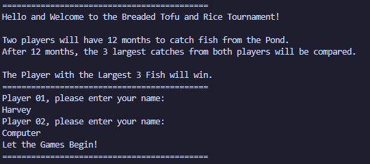
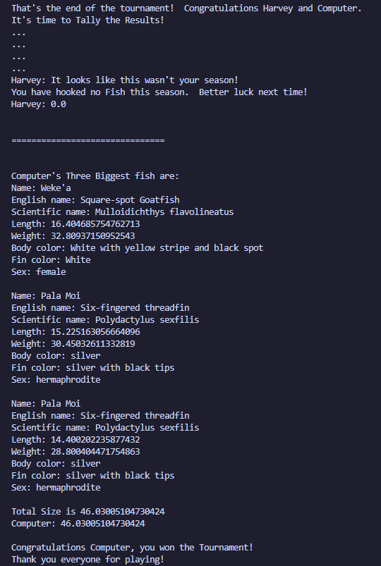

My team and I created a text-based Hawaiian fishing tournament simulator game during the spring semester of ICS 211. This collaborative effort compiled a semester's worth of learning object-oriented programming and intermediate data structures all using the Java programming language.

### Synopsis

Loko i'a and Lawa i'a are the Hawaiian words for fish pond and fishing respectively. In this text-based Hawaiian fishing tournament simulator, the goal is to catch the largest cumulative fish compared to your competitor. The game utilizes data from real Hawaiian fish families that exist and are caught locally.

## Contributions

Throughout this project, I was responsible mainly for implementing the code for the various fish families and the hierarchies of inheritance. I have provided a code snippet of the 'Ama'ama fish family class I wrote:
